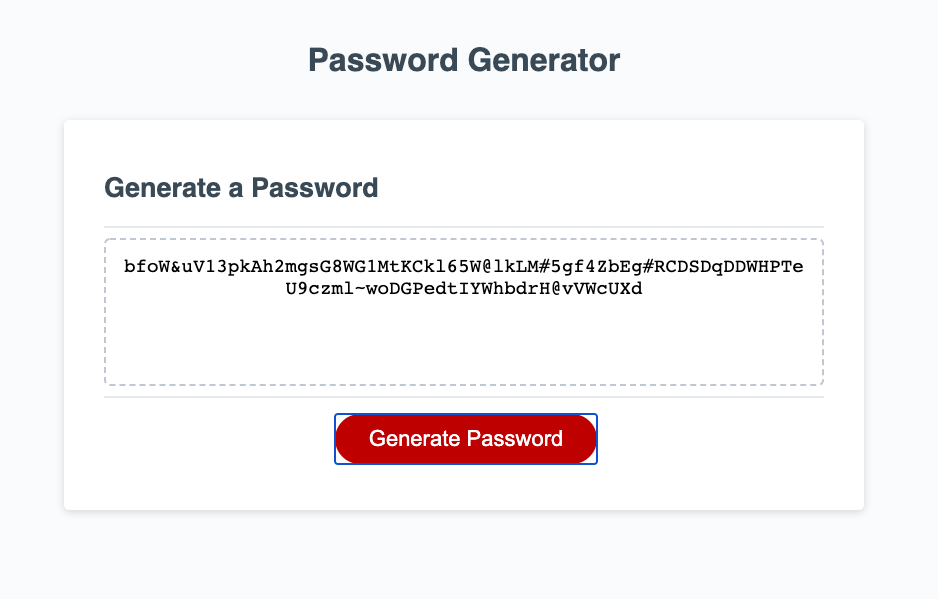
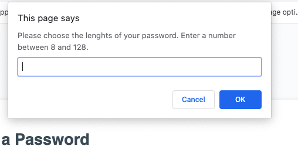

# Random-Password-Generator

This is a Random Password Generator using Javascript language and window modal boxes.

# Requirements:

Create a website containing the following pages and information:

* About Me - contain some information about myself
* Porftfolio - contain projects information
* Contact - page with a form

**Criteria provider by the client:**

```
GIVEN I need a new, secure password
WHEN I click the button to generate a password
THEN I am presented with a series of prompts for password criteria
WHEN prompted for password criteria
THEN I select which criteria to include in the password
WHEN prompted for the length of the password
THEN I choose a length of at least 8 characters and no more than 128 characters
WHEN prompted for character types to include in the password
THEN I choose lowercase, uppercase, numeric, and/or special characters
WHEN I answer each prompt
THEN my input should be validated and at least one character type should be selected
WHEN all prompts are answered
THEN a password is generated that matches the selected criteria
WHEN the password is generated
THEN the password is either displayed in an alert or written to the page
```


# Mockup:





# How it Works?:

* User will be prompt to enter how many characters they would like for their password to contain. 
User most choose between 8 and 128 characters.

* After entering the lenght of the password, user will be ask to choose for charaters type to include in their password. Character types such as:
    * Upper or/and Lower case letters
    * Numbers
    * Special Characters
* A random passwork will be generating containing the leght enter and the selected character types
* The application generates one password at one time. Refresh the page to generation additional passwords are needed.

# Resources:

* Visual Code - used to modify html and css files
* Google developer tools - to test changes
* Chrome, Safari, Firefox - to ensure page render correctly
* Mozilla JavaScript

# Repository:

* Repository: https://github.com/CivicaJR91/Random-Password-Generator
* Page Link: https://civicajr91.github.io/Random-Password-Generator/


